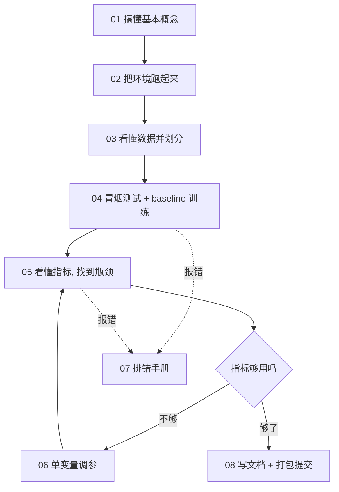

# RM 视觉培训作业 新手指南

这是一份**从零开始**的培训教程。假设你此前没有做过深度学习训练，只要会基本的 Python 和命令行操作，跟着本教程一步一步做，就能独立完成"用 YOLO 训练一个目标检测模型"的作业，并产出一份合格的交付物。

> 配套参考实现（本次作业完成后的成果仓库，含完整实验记录与数据下载）：
> <https://github.com/tianminmax/RM-YOLO26-Training>

---

## 学完你能做到什么

1. 说清一次训练到底发生了什么（前向、损失、反向、更新、验证）
2. 看懂自己的数据与标签，并把它切成 train/val/test
3. 从零跑通一次检测模型训练，并读懂训练日志
4. 看懂 mAP50 / mAP75 / mAP50-95、PR 曲线、混淆矩阵
5. 遇到报错知道按什么顺序排查，而不是瞎改参数
6. 用"一次只改一个变量"的方法把指标往上推
7. 产出合格的交付物：文档、训练表格、模型权重

---

## 怎么用这份教程

**不要通读后再动手。** 每一章都是"读一点 → 立刻动手 → 看到结果 → 再往下"。每章末尾都有【检查点】，做不出来就不要前进。

两条路线，按你的剩余时间选：

| 路线 | 适用 | 章节 | 预计耗时 |
|---|---|---|---|
| **保命路线** | 只剩 1 天 | 02 → 03 → 04 → 05（只读"怎么看指标"）→ 08（只读交付） | 6~8 小时 |
| **标准路线** | 有 2~3 天 | 全部章节，含 06 调参方法、07 排错手册 | 2~3 天 |

> 经验：**先保证能交付，再追求好成绩。** 一个跑通并写清楚的 baseline（mAP50 0.9 左右），比一个没跑完的"调参实验"得分高得多。

---

## 章节导航

| 章节 | 内容 | 类型 |
|---|---|---|
| [01-预备知识](01-预备知识.md) | 目标检测、YOLO、损失函数、迁移学习、mAP，只讲够用的 | 概念 |
| [02-环境搭建](02-环境搭建.md) | conda、CUDA、PyTorch、ultralytics 的安装与验证 | 动手 |
| [03-数据准备](03-数据准备.md) | 标签格式、数据体检、划分 train/val/test、data.yaml | 动手 |
| [04-训练入门](04-训练入门.md) | 冒烟测试、baseline 训练、读懂训练日志、断点续训 | 动手 |
| [05-看懂指标](05-看懂指标.md) | mAP 家族、PR 曲线、混淆矩阵、判断瓶颈、推理参数 conf/iou | 概念 + 动手 |
| [06-调参方法](06-调参方法.md) | 单变量原则、优先级决策、时间预算 | 方法 |
| [07-排错手册](07-排错手册.md) | 按现象查问题：环境、显存、数据、训练、指标 | 工具 |
| [08-进阶与交付](08-进阶与交付.md) | 未标注数据、模型规模、文档与提交规范 | 动手 |
| [附录-术语与速查](附录-术语与速查.md) | 术语表、命令速查、交付前检查清单 | 参考 |

> **也有 Jupyter Notebook 版本**：如果你更喜欢"边跑边看结果"，可以直接用 [`notebooks/`](notebooks/README.md) 里的三个 notebook
> （环境与数据 / 训练与评估 / 调参与交付）。内容与上面的章节一一对应，但把命令、数据检查、图表都做成了可运行的单元。
> 用法与内核配置见 [notebooks/README.md](notebooks/README.md)。

---

## 学习路线图



---

## 配套代码

本教程附带的脚本在 `code/` 目录下，都是可以直接运行的：

| 脚本 | 作用 | 在哪一章用 |
|---|---|---|
| `prepare_data.py` | 按框数分层划分数据，生成 `data.yaml` | 03 |
| `train.py` | 训练（含断点续训护栏、自动打印可抄进表格的一行） | 04 |
| `eval.py` | 在指定集合上评估，输出 mAP50 / mAP75 / mAP50-95 | 05 |
| `analyze_errors.py` | 逐张误差分析，输出漏检清单与红黑对比图 | 05 |
| `autolabel.py` | 给未标注数据生成预标注 | 08 |
| `merge_addon.py` | 把新增数据并进训练集（构建独立数据集，不动原数据） | 08 |

使用方式见各章说明。脚本会**自动向上查找作业根目录**（以 `data/`、`datasets/`、`codebase/` 这三个目录为标志），因此下面两种写法都能正常工作：

```bash
python code/train.py --name smoke --epochs 1 --fraction 0.02 --imgsz 320 --batch 4   # 脚本留在 code/ 里
python train.py      --name smoke --epochs 1 --fraction 0.02 --imgsz 320 --batch 4   # 或把脚本复制到作业根目录
```

本教程各章统一用第一种写法。若你的目录结构与教程不同，也可以用 `--data`、`--project` 等参数显式指定路径。

---

## 三个最重要的原则

新手最容易在这三件事上翻车，先记住：

1. **test 集只能用一次。** 它是你最终成绩的来源。用它反复试参数，成绩就不可信了。
2. **一次只改一个变量。** 同时改三个参数，指标涨了你也不知道是谁的功劳。
3. **先跑通，再调优。** 链路没通之前调参是浪费时间；用极小规模（2% 数据、1 个 epoch）先验证一遍。
